<div align="center">
  <h1>
    <br/>
    AI Vision Assistant
  </h1>
  <h3>A Modern Image Analysis & Chat Interface Powered by Google's Gemini Pro Vision</h3>
</div>

<p align="center">
    <a href="https://gemini-imageapi-jamalihassan0307.netlify.app/" target="_blank">
        
    </a>
    <a href="https://github.com/jamalihassan0307" target="_blank">
        
    </a>
    <a href="https://www.linkedin.com/in/jamalihassan0307/" target="_blank">
        
    </a>
</p>

## 📌 Overview

AI Vision Assistant is a cutting-edge web application that combines image analysis capabilities with natural language processing using Google's Gemini Pro Vision API. The application offers an intuitive interface for users to analyze images, get detailed descriptions, and interact with AI in natural language.

## 🚀 Features

### Core Functionality

- 🖼️ Image Analysis & Recognition
- 💬 Natural Language Chat Interface
- 🔄 Real-time AI Responses
- 📱 Responsive Design
- 🌓 Light/Dark Theme Support

### User Experience

- 🔐 Secure Authentication
- 👤 User Profile Management
- ⚙️ Customizable Settings
- 📂 Chat History Management
- 🔍 Image Upload & Analysis

## 🛠️ Tech Stack


## 📸 Screenshots

### Home & Authentication

<div align="center">
  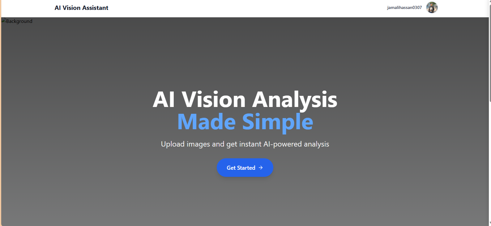
  
  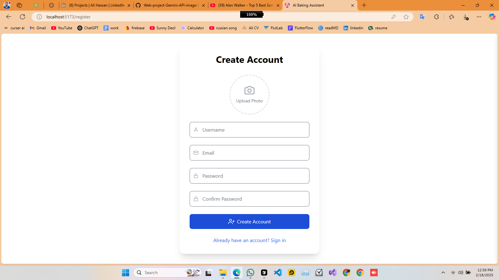
</div>

### Chat & Image Analysis

<div align="center">
  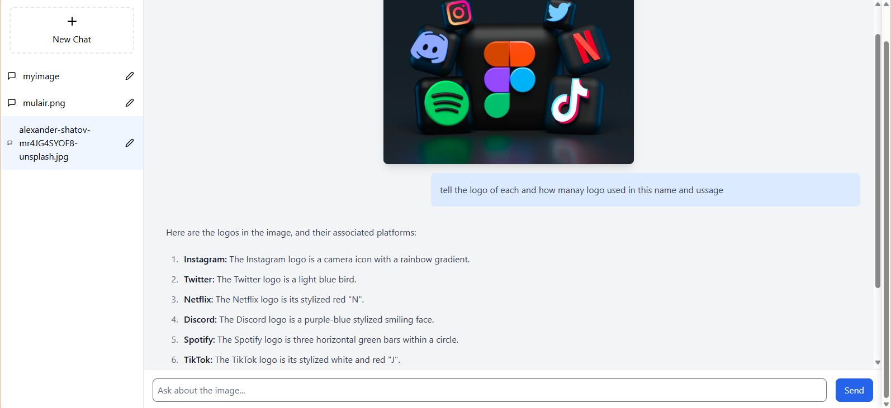
  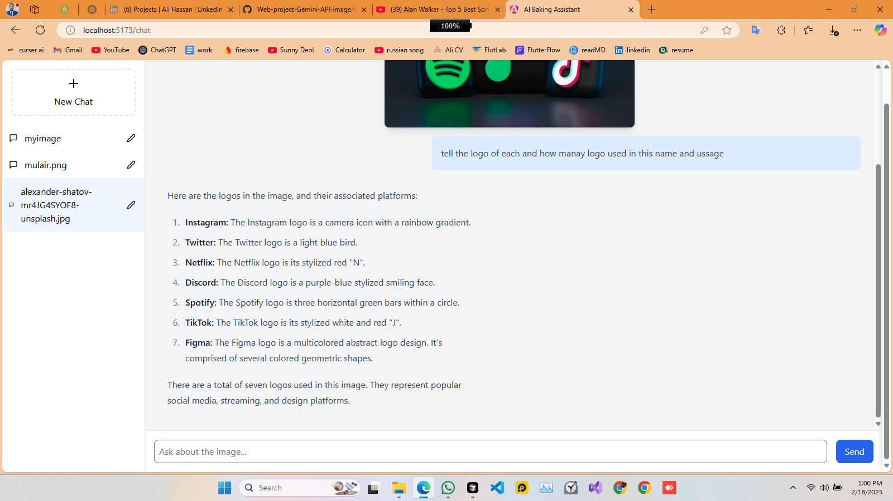
  
  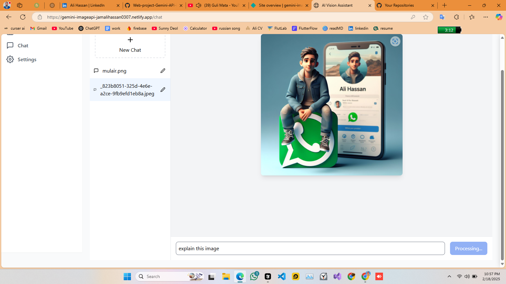
  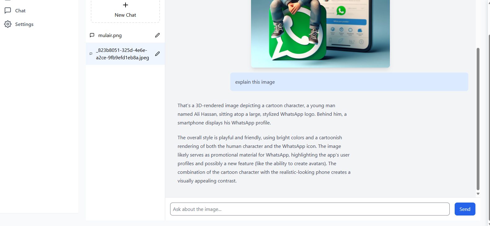
  
  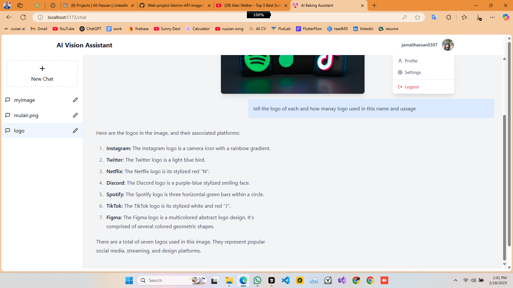
</div>

### User Interface

<div align="center">
  
  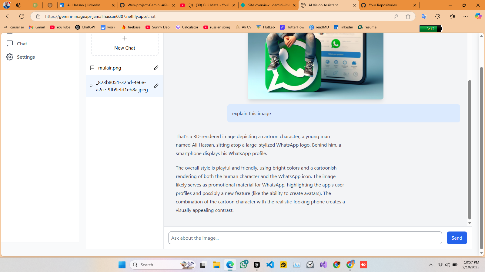
  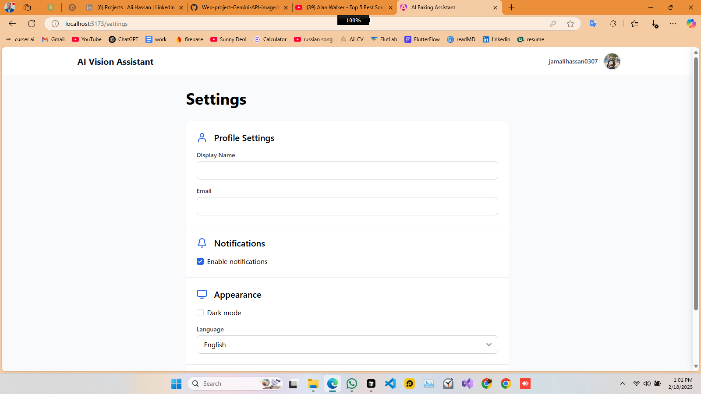
  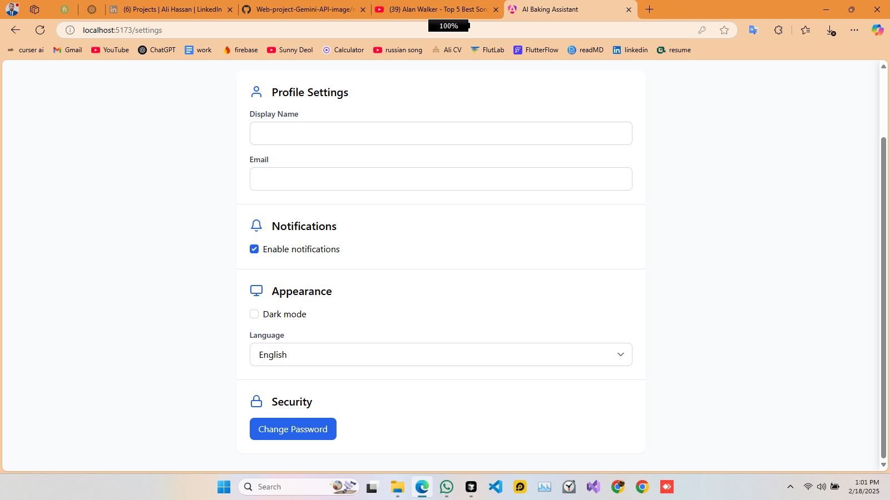
  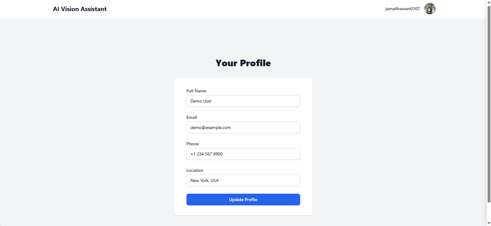
</div>

## 🚀 Getting Started

1. Clone the repository

```bash
git clone https://github.com/yourusername/ai-vision-assistant.git
```

2. Install dependencies

```bash
cd ai-vision-assistant
npm install
```

3. Set up environment variables

```bash
VITE_GEMINI_API_KEY=your_api_key_here
```

4. Start the development server

```bash
npm run dev
```

## 📁 Project Structure

```
src/
├── components/
│   ├── Layout/
│   │   ├── Header.tsx
│   │   ├── Sidebar.tsx
│   │   └── index.tsx
│   └── Chat/
├── contexts/
│   ├── AuthContext.tsx
│   └── ChatContext.tsx
├── pages/
│   ├── Login.tsx
│   ├── Chat.tsx
│   ├── Profile.tsx
│   └── Welcome.tsx
└── styles/
```

## 🔑 Key Features Explained

### Image Analysis

- Upload and analyze images using Gemini Pro Vision API
- Get detailed descriptions and insights
- Support for multiple image formats

### Chat Interface

- Real-time conversation with AI
- Context-aware responses
- Message history management
- Chat renaming and organization

### User Management

- Secure authentication system
- Profile customization
- Settings management
- Theme preferences

## 🤝 Contributing

Contributions are welcome! Please feel free to submit a Pull Request.

## 📝 License

This project is licensed under the MIT License - see the [LICENSE](LICENSE) file for details.

## 👨‍💻 Developer

Developed by [Ali Hassan](https://github.com/jamalihassan0307)

---

<p align="center">
  Made with ❤️ using React, TypeScript, and Google's Gemini Pro Vision
</p>
